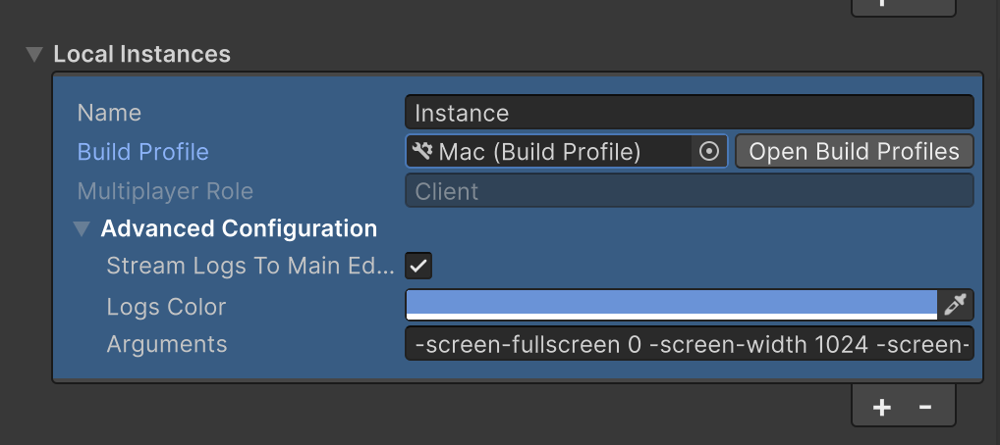

# Local instances

Local instances are built and run on your local machine or connected devices. They provide a more realistic testing environment closer to your final build while maintaining quick iteration cycles.

Local instances support both desktop and Android platforms.

## Configure your instance

To configure a local instance:

1. In the Play Mode Scenarios window, select **Add Instance**.
2. Select **Local** from the instance type dropdown.
3. Choose your target platform by selecting a build profile (Windows, Mac, Linux, or Android).
4. Configure build settings and runtime parameters as needed.

## Android device testing

Android device testing allows you to test your project on physical mobile hardware.

To connect an Android device, follow the steps here: [Connect to a device](https://docs.unity3d.com/Packages/com.unity.mobile.android-logcat@1.4/manual/connect-to-a-device.html).

To learn more about the properties that you can use to configure a local instance, refer to [Play Mode Scenarios window reference](../mppm-reference/play-mode-scenario-window-reference.md).
