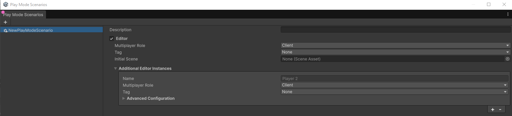
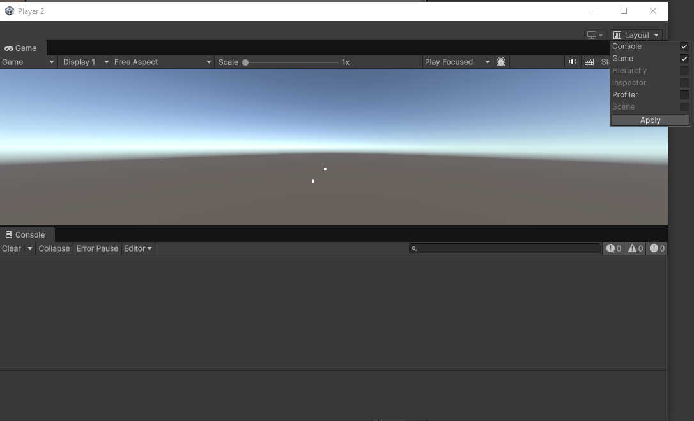
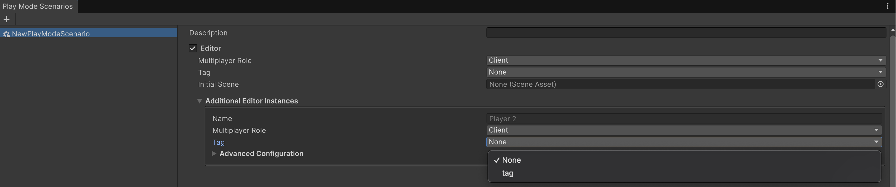

# Editor instances

Multiplayer Play Mode streamlines local multiplayer testing by using a Editor instance alongside one or more additional Editor instances.

The Editor is the standard, fully-featured Unity Editor where you develop, launch, and manage your multiplayer
game. It also serves as a central point of control for starting and stopping the orchestration of a Play Mode Scenario.
Starting a Play Mode Scenario from the Editor automatically launches the configured number of additional Editors.
Each additional Editor is a separate child process, distinct from the Editor, that acts as additional game clients.

In your project, an additional Editor instance is represented by its own folder within the project's `/Library/VP/`
directory, which stores unique configuration settings and data. Any asset or code changes made in the Editor are
automatically reflected in additional Editors, as they share the Editor's `Library` folder. This folder also
contains a `SystemData.json` file that defines an additional Editor's unique configuration, such as its role (client or
server) and other runtime parameters.

Scenarios with additional Editors enable rapid testing of complex multiplayer interactions, such as a client connecting
to a host or server, all directly on your development machine. It eliminates the need to create and manage separate
standalone builds, significantly accelerating the development and debugging workflow for your multiplayer project.

## Configure an instance

You can configure Editor and additional Editor instances from the Play Mode Scenarios window:

1. If you haven't done so already, [create your Play Mode Scenario](../play-mode-scenario/play-mode-scenario-create.md).
2. Select the scenario that you've created, or one that already exists.
3. Editor and additional Editor instances are displayed on the right-hand side of the window.
4. If none are showing, ensure that the checkbox next to **Editor** is selected.
5. To add more additional Editor instances, click the **+** button under **Additional Editor Instances**.



## Focusing on additional editors

Additional Editor instances within a Play Mode Scenario can be started as game clients (Players), each with its own
window that can be minimized or hidden. As such, you can focus on to these instances in two ways:

* Select the **Focus on Player** icon in the Active Scenario window pertaining to that instance.
* Use the focus player keyboard shortcuts.

### Focusing on an additional Editor through the Active Scenario window

1. Open the Active Scenario window.
2. Navigate to the Editor instance you wish to focus on.
3. Click on the Focus icon .
4. The corresponding Editor window should be displayed.

### Focus on an additional Editor with keyboard shortcuts

Use the following keyboard shortcuts to switch focus to a specific window:

| **Shortcut**                              | **Description**        |
|-------------------------------------------|------------------------|
| **Ctrl**+**F9** (macOS: **Cmd**+**F9**)   | Focus on **Player 1**. |
| **Ctrl**+**F10** (macOS: **Cmd**+**F10**) | Focus on **Player 2**. |
| **Ctrl**+**F11** (macOS: **Cmd**+**F11**) | Focus on **Player 3**. |
| **Ctrl**+**F12** (macOS: **Cmd**+**F12**) | Focus on **Player 4**. |

## Configuring the layout for additional Editors

You can customize the layout of each Editor instance to help you monitor and debug your game more effectively. The
window of these Editors is composed of several panels that you can toggle to configure the layout according to your
needs. This allows you to focus on different aspects of your game for each player, such as viewing a specific Editor's
console logs or monitoring rendering statistics, for example.

- [Console](https://docs.unity3d.com/Manual/Console.html)
- [Game](https://docs.unity3d.com/Manual/GameView.html)
- [Hierarchy](https://docs.unity3d.com/Manual/Hierarchy.html)
- [Inspector](https://docs.unity3d.com/Manual/UsingTheInspector.html)
- [Scene](https://docs.unity3d.com/Manual/UsingTheSceneView.html)
- [PlayMode Tools](https://docs.unity3d.com/Packages/com.unity.netcode@1.6/manual/playmode-tool.html). This window only appears in projects that use [Netcode for Entities](https://docs.unity3d.com/Packages/com.unity.netcode@latest).
- [Profiler](https://docs.unity3d.com/Manual/ProfilerWindow.html)

> [!NOTE]
> You can only use the Hierarchy, Inspector, and Scene windows while in Play mode.

To display or hide layout panels in additional Editors, perform the following actions:

1. Focus on the Editor you want to configure from within the Active Scenario window.
2. In the additional Editor, select the **Layout** dropdown on the top right.
3. Select the box next to the specific panel(s) you want to view within this instance.
4. Select **Apply**.



## Tags

You can use tags to configure behavior for Players in both the Editor and any additional Editor instances you may have. For example, you can use tags to:
- Automatically assign a Player to a specific team you have in your game.
- Have Players move faster or slower to simulate real-world network connections.

> [!NOTE]
> You can assign only one tag to a Player in the Play Mode Scenario window

### Create a tag

1. Open the Player Tags window, navigate to **Edit** > **Project Settings** > **Multiplayer** > **PlayMode** > **Player Tags**.
2. Select the plus sign  to create a tag.
3. Name the tag.
4. Select **Save**. The new tag is automatically added to the local project directory in `...\[example-project-name]\ProjectSettings\VirtualProjectsConfig.json`.
5. The new tag appears in the **Tag** section of the Play Mode Scenarios window for your currently selected scenario.



### Attach a tag to a Player in the Play Mode Scenarios window

1. After [creating a tag](#create-a-tag), open the Play Mode Scenarios window (**Window** > **Play Mode** > **Scenarios**).
2. Expand the **Tags** dropdown for the Editor Player or additional Editor instances.
3. Select the tag you just created.

### Use tags in a player script

Tags don't do anything until you configure them. To configure a tag:

1. Use `CurrentPlayer.ReadOnlyTags()` to target the tag in a script.
2. Attach the script to a [NetworkObject](https://docs.unity3d.com/Packages/com.unity.netcode.gameobjects@latest?subfolder=/manual/components/core/networkobject.html), such as the Player.

Use the following tag examples as guides for your own scripts:

- [Simulate network conditions](#use-tags-to-simulate-network-conditions)
- [Automatically assign a Player to a team](#use-tags-to-assign-a-player-to-a-team)


### Examples

#### Use tags to simulate network conditions

The logic in the following example checks if the tag has a string rather than if it's equal to a string to allow for more flexibility with the name of the tag. You can change this logic so that it checks for an exact match.


This example script uses the [Network Simulator tool](https://docs.unity3d.com/Packages/com.unity.multiplayer.tools@latest?subfolder=/manual/network-simulator.html) and its [network configuration presets](https://docs.unity3d.com/Packages/com.unity.multiplayer.tools@latest?subfolder=/manual/network-simulator.html#network-configuration-presets) to automatically simulate a fast or slow network based on the tag. A Player with the `FastNetwork` tag simulates a common home broadband connection, and a Player with the `SlowNetwork` tag simulates a mobile 2.5G connection.

```csharp
using System.Collections;
using System.Collections.Generic;
using UnityEngine;
using Unity.Multiplayer.Playmode;
using Unity.Multiplayer.Tools.NetworkSimulator.Runtime;

public class NetworkSimulation : MonoBehaviour
{
    void Start()
    {
        var networkSimulator = GetComponent<NetworkSimulator>() ??
                               gameObject.AddComponent<NetworkSimulator>();

        var connectionPreset = NetworkSimulatorPresets.None;
        if (CurrentPlayer.ReadOnlyTags() == "FastNetwork")
        {
            connectionPreset = NetworkSimulatorPresets.HomeBroadband;
        }
        else if (CurrentPlayer.ReadOnlyTags() == "SlowNetwork")
        {
            connectionPreset = NetworkSimulatorPresets.Mobile2_5G;
        }

        networkSimulator.ConnectionPreset = connectionPreset;
    }
}
```

### Use tags to assign a player to a team

The logic in the following example checks if the tag has a string rather than if it's equal to a string to allow for more flexibility with the name of the tag. You can change this logic so that it checks for an exact match.

> [!IMPORTANT]
> The following example uses the `Contains` method, which is case-sensitive by default. You can make it case-insensitive by passing the `System.StringComparison.CurrentCultureIgnoreCase` method.

The following script automatically sets a [NetworkVariable](https://docs.unity3d.com/Packages/com.unity.netcode.gameobjects@latest?subfolder=/manual/basics/networkvariable.html) called `Team` based on the tag.

A Player with a `Red` tag automatically sets the `Team` NetworkVariable to `Red`. A Player with a `Blue` tag automatically sets the `Team` NetworkVariable to `Blue`.

```csharp
using Unity.Netcode;
using UnityEngine;
using Unity.Multiplayer.Playmode;

public enum Team { Blue, Red, }

/// A player with a team that is automatically assigned
/// based on the tag of the client that owns them
public class Player : NetworkBehaviour
{
    public NetworkVariable<Team> team = new (writePerm: NetworkVariableWritePermission.Owner);

    void Start()
    {
        var localClientId = NetworkManager.Singleton.LocalClientId;
        if (!team.CanClientWrite(localClientId))
        {
            return;
        }
        var mppmTag = CurrentPlayer.ReadOnlyTags();
        if (mppmTag.Contains("Blue"))
        {
            team.Value = Team.Blue;
        }
        if (mppmTag.Contains("Red"))
        {
            team.Value = Team.Red;
        }
    }
}
```
