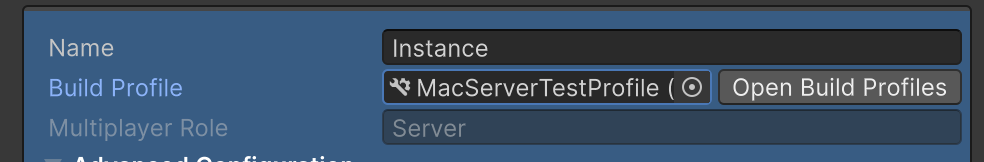
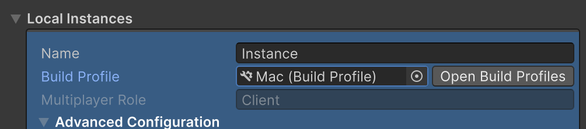
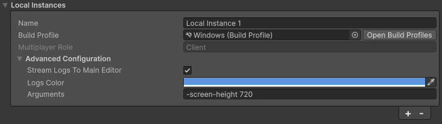
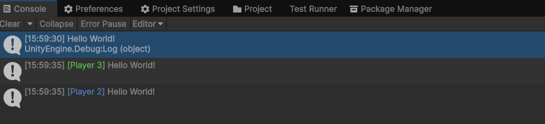
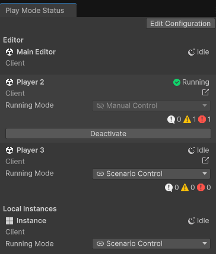
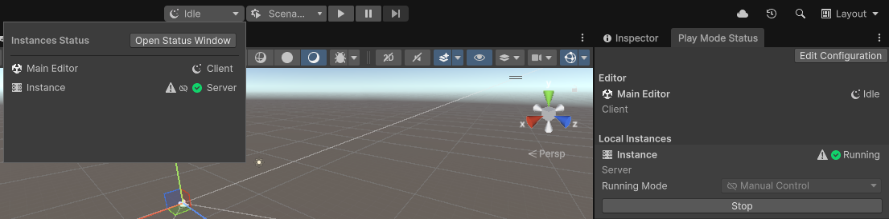

# Scenario configurations 

## Basic configuration

### Integrate with a dedicated server

The [Dedicated Server package](https://docs.unity3d.com/Packages/com.unity.dedicated-server@1.0/manual/index.html) adds [Multiplayer Roles](https://docs.unity3d.com/Packages/com.unity.dedicated-server@1.0/manual/multiplayer-roles.html) to the [Dedicated Server build platform](https://docs.unity3d.com/Manual/dedicated-server-introduction.html). You can use Multiplayer Roles to assign instances to a client, server, or client and server Multiplayer Role.

When using a dedicated server architecture, assign roles to instances by selecting the appropriate build profile:

1. Select an instance in the Play Mode Scenarios window
2. Choose the appropriate **Build Profile**:
    - **Server build profiles**: For server instances
    - **Standalone build profiles**: For client instances






## Advanced configuration

Advance configuration provides a set of options you can use to optimize development workflows, providing the ability to
specify runtime execution parameters, debugging logging capabilities, and ways to accelerate iteration speeds.

### Runtime arguments

You can specify runtime command-line arguments for [local](../instance-types/local-instance.md) instances.

1. Navigate to **Window** > **Play Mode** > **Scenarios**.
2. Navigate to the local instance you want to add arguments to.
3. Expand the **Advanced Configuration** section.
4. Fill out the **Arguments** text field with the command-line arguments and the values you want to pass to the launched instance.

#### Screen height example

This is a visual example of the `-screen-height` argument added to a local instance:



You can parse the `-screen-height` argument using the `System.Environment.GetCommandLineArgs()` method to get the list
of the launch arguments and then search through that list.

C# example:
```csharp
using System;

public class Example : MonoBehaviour
{
    var arguments = Environment.GetCommandLineArgs();
    var screenHeight = arguments[arguments.IndexOf("-screen-height") + 1];
    // Do something with screenHeight
}

```

### Logging

You can stream player logs from other running game instances directly to the main Editor for debugging.

1. Navigate to **Window** > **Play Mode** > **Scenarios**.
2. Navigate to the instance you want to stream logs from.
3. Check the **Stream Logs to Main Editor** box.
4. Choose the log color you want your logs to be tagged with (optional).

The following is an example of enabling stream logs with Player 2 and Player 3 instances in different colors:



### Free running instances and running modes

Free running instances are independent of scenario execution, allowing more flexible workflows and faster iteration in
main Editor and local instances. Enable a free running instance by toggling an instance's running mode
parameter.



#### Running mode parameter options

The running mode parameter has two options:

|**Option**| **Description**                                                                                                                                                                                                                                                                                   |
|-|---------------------------------------------------------------------------------------------------------------------------------------------------------------------------------------------------------------------------------------------------------------------------------------------------|
|  Scenario control| Scenario control is the default behavior. Under scenario control, instance execution is done through the Play mode button, along with other scenario controlled instances. All scenario controlled instances are launched and stopped simultaneously. |
| Manual control | Manual control allows instances to run independently from the main scenario, enabling fine tuning of what needs to be re-compiled and relaunched between different Play mode events.|

#### Using manual control

Manual control is useful when some instances require fewer updates than others, eliminating the need for full rebuilds
and redeployments with each change and significantly reducing iteration time.

You can change the running mode to manual control using the Active Scenario window (**Window** > **Play Mode** >
**Active Scenario**). To launch an instance independently, either press **Activate** for Editor instances or **Run** 
for local instances.

> [!NOTE]
> Manually controlled instances are still part of the scenario and still appear in the Active Scenario window. If the streaming log option is enabled, logs are still displayed in the console of the main Editor.

#### Managing synchronization with the Editor

When iterating on your multiplayer game using free running instances, you might make changes in the main Editor, such as
modifying code, scenes, or assets. These actions can cause a manually controlled running instance to become out of sync
with your project. This desynchronization is known as coherence drift, causing the game in the running instance to no
longer reflect the current game state in the main Editor. This mainly affects local instances.

When coherence drift occurs, a drift warning icon appears in the Active Scenario window and Play Mode pop-up window.
Restart the affected instance to resolve the drift and ensure the running instance reflects your latest changes.



### Android player settings

You can target a local instance to build and launch onto Android platforms. Be aware that there are often issues with
Android platforms when the generated APK doesn't match the platform CPU architecture, or if the scripting backend isn't
supported by your Android platform.

#### Example with Google Pixel phones
1. Go to **Project Settings** > **Player** > **Android** > **Configuration**.
2. Ensure the selected scripting backend is `IL2CPP` rather than `MONO`.
3. Ensure the target architecture is ARM64.

For other Android-based platforms, refer to the corresponding platform documentation to see what architecture and
scripting backend options are recommended.

## Additional resources

* [Play Mode Scenarios requirements and limitations](play-mode-scenario-req.md)
* [Create a Play Mode Scenario](play-mode-scenario-create.md)
* [Troubleshoot a test build](../troubleshoot/play-mode-scenario-troubleshoot.md)
