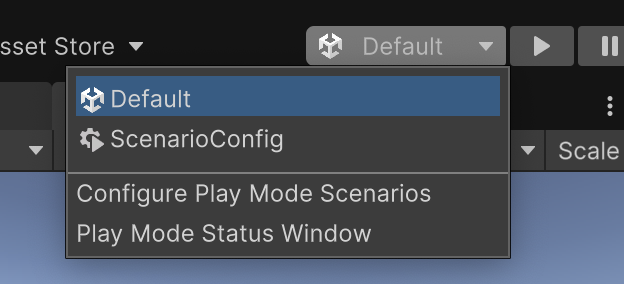

# Create a Play Mode scenario

A Play Mode Scenario is a configuration that allows you to test multiplayer functionality by running multiple instances of your game simultaneously. Each scenario defines how different instances will behave and interact within your multiplayer environment.

To create a Play Mode Scenario:

1. Open the Play Mode Scenarios window from **Window** > **Play Mode** > **Scenarios** or select the Play Mode dropdown menu.
2. Select **Configure play mode scenarios**.
3. Click the **+** button to create a new scenario.
4. Configure your scenario with the desired instances and settings.
5. Enter Play Mode to automatically build and run all configured instances.

For more information about the different instance types you can add to a Play Mode Scenario, refer to [Instance types](../instance-types/instance-types.md).

## Additional resources

- [Play Mode Scenarios requirements and limitations](play-mode-scenario-req.md)
- [Play Mode scenario window reference](../mppm-reference/play-mode-scenario-window-reference.md)
- [Instance types](../instance-types/instance-types.md)
- [Build Profiles](https://docs.unity3d.com/6000.0/Documentation/Manual/build-profiles.html)
